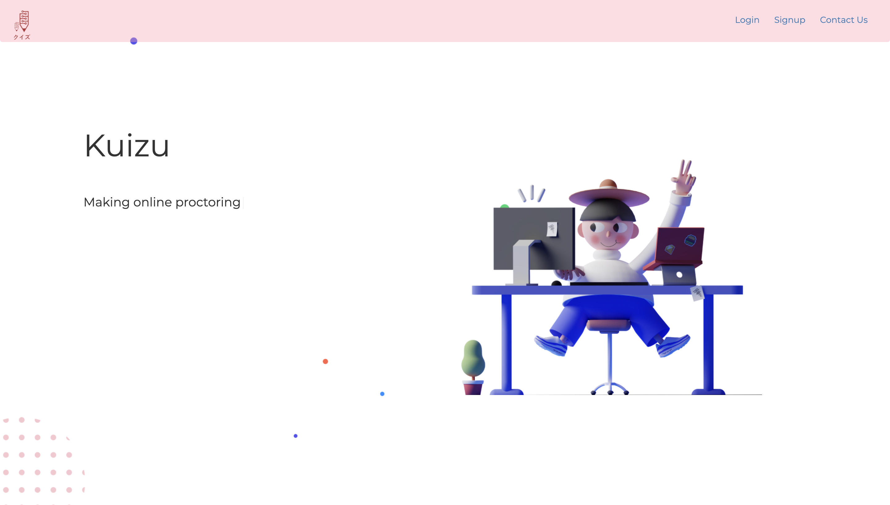
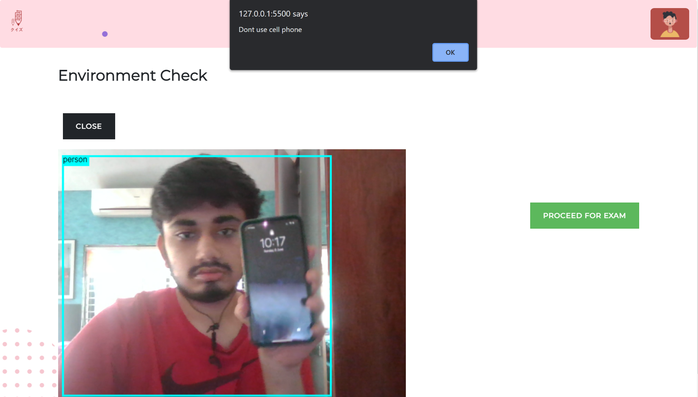
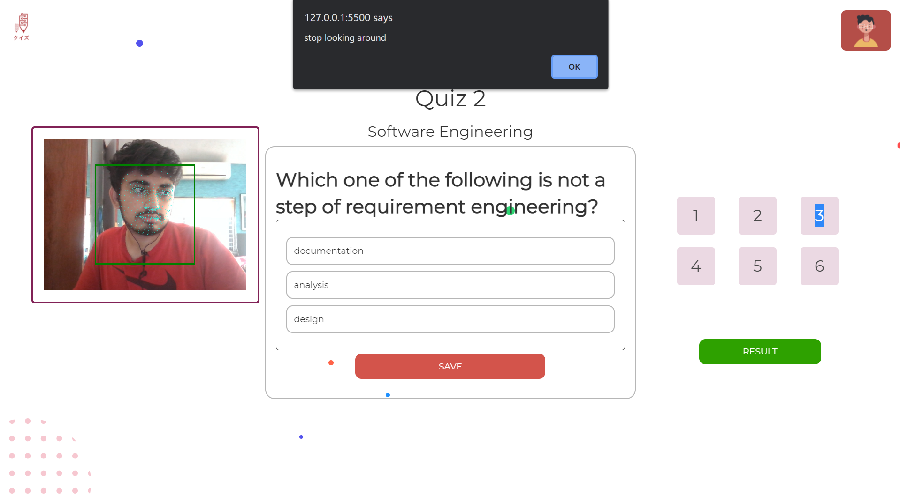

# KUIZU - AUTOPROCTORED QUIZ SYSTEM

> Making Proctoring of Online Quizzes Simple And Easy With Least Human Interference!

## Features

#### USER
- Authentication and Authorization of the user 
- Attempting the quiz 
- Continuous Eye Tracking
- Audio and video checks 
- Cell phone detection
- Multiple user detection
- Automatic Report Generations
- Contact Admin in case of discrepancies

#### ADMIN
- Create Quiz
- Delete Quiz
- Check Live status of the attendees

## Tech Stack

<table>
  <tbody>
     <tr valign="top">
      <td width="25%" align="center">
        <span><strong>Node.Js</strong></span><br><br><br>
        
      </td>
       <td width="25%" align="center">
        <span><strong>MongoDB</strong></span><br><br><br>
        
      </td>
       <td width="25%" align="center">
        <span><strong>Docker</strong></span><br><br><br>
        
      </td>
    </tr>
    <tr valign="top">
      <td width="25%" align="center">
        <span><strong>JavaScript</strong></span><br><br><br>
        
      </td>
           <td width="25%" align="center">
        <span><strong>Html</strong></span><br><br><br>
        
      </td>
       <td width="25%" align="center">
        <span><strong>CSS</strong></span><br><br><br>
        
      </td>
    </tr>
    
    
    

  </tbody>
</table>

## Screenshots






## Steps to run
```
$ git clone https://github.com/N0v0cain3/Kuizu.git
$ cd backend && npm i 
$ npm start
```
## Contributors
- <a href="https://github.com/N0v0cain3">Shivam Mehta</a>
- <a href="https://github.com/mounvip1525">Mounvi Podapati</a>
- <a href="https://github.com/Manasvi070902">Manasvi Alimchandani</a>

